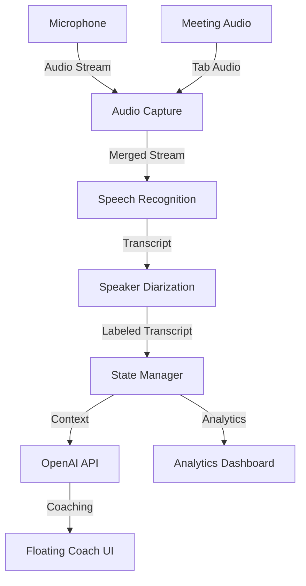

# 🚀 Premium Sales Coach - Improvements Roadmap

**Status**: Post v3.0 Analysis
**Date**: Generated after comprehensive code audit
**Total Issues Identified**: 52 improvements across 6 categories

---

## ✅ **COMPLETED (Just Fixed!)**

### Critical Bugs - Phase 1
- [x] **Race Condition Protection** - Added `isStarting` flag to prevent double initialization
- [x] **Infinite Restart Loop** - Limited auto-restart to 5 attempts per minute
- [x] **OpenAI Timeout** - Added 30-second timeout to prevent hung requests
- [x] **Tab Audio Handler** - Verified message handler exists and works

---

## 🔴 **HIGH PRIORITY** (Next 2 Weeks)

### Security & Stability

#### 1. API Key Validation
**Priority**: Critical
**Effort**: 2 hours
**Files**: `extension/options/options.js`, `extension/content/premium-sales-coach.js`

**Current Issue**:
```javascript
// Only checks if key exists
if (!this.config.openAIKey) {
  alert('Missing key!');
}
```

**Required Fix**:
```javascript
function validateOpenAIKey(key) {
  // Format: sk-proj-... (new format) or sk-... (old format)
  const pattern = /^sk-(proj-)?[A-Za-z0-9]{20,}$/;
  if (!pattern.test(key)) {
    return { valid: false, error: 'Invalid API key format' };
  }

  // Test connection
  return await testOpenAIConnection(key);
}
```

**UI Improvements**:
- Masked input (show only last 4 chars)
- "Test Connection" button
- Visual feedback (✅ Valid / ❌ Invalid)
- Link to OpenAI docs

---

#### 2. Error Boundaries & Recovery
**Priority**: Critical
**Effort**: 4 hours
**Files**: `extension/content/premium-sales-coach.js`

**Current Issue**: If `init()` fails, extension is dead. No recovery.

**Required Implementation**:
```javascript
class PremiumSalesCoach {
  async init() {
    try {
      await this.loadConfig();
      this.initializeUI();
      // ...
    } catch (error) {
      this.handleInitError(error);
    }
  }

  handleInitError(error) {
    // Show recovery UI
    this.showErrorRecoveryUI({
      error: error.message,
      actions: [
        { label: 'Open Settings', onClick: () => chrome.runtime.openOptionsPage() },
        { label: 'Reload Extension', onClick: () => location.reload() },
        { label: 'Report Issue', onClick: () => this.openGitHubIssue(error) }
      ]
    });

    // Log to analytics (if implemented)
    this.reportError(error);
  }
}
```

---

#### 3. Cleanup on Failure
**Priority**: High
**Effort**: 3 hours
**Files**: `extension/content/premium-sales-coach.js`

**Current Issue**: If step 3 of 5 fails in `start()`, steps 1-2 aren't cleaned up.

**Required Fix**:
```javascript
async start() {
  const cleanup = [];

  try {
    // Step 1: Audio capture
    await this.audioCapture.start();
    cleanup.push(() => this.audioCapture.stop());

    // Step 2: Speech recognition
    this.speechRecognition.start();
    cleanup.push(() => this.speechRecognition.stop());

    // Step 3: etc...

    this.isActive = true;
  } catch (error) {
    // Cleanup in reverse order
    for (const fn of cleanup.reverse()) {
      try { await fn(); } catch (e) { console.error(e); }
    }
    throw error;
  }
}
```

---

### Performance Optimizations

#### 4. Request Coalescing
**Priority**: High
**Effort**: 3 hours
**Files**: `extension/content/premium-sales-coach.js`

**Current Issue**: If client says 2 things quickly (<500ms apart), generates 2 separate (expensive) OpenAI calls.

**Solution**: Debounce coaching generation
```javascript
import { debounce } from './utils/debounce.js';

class PremiumSalesCoach {
  constructor() {
    // Debounce AI coaching generation (500ms)
    this.generateAICoachingDebounced = debounce(
      this.generateAICoaching.bind(this),
      500
    );
  }

  async handleFinalTranscript(transcript) {
    // ... existing code ...

    if (speaker === 'client') {
      // Use debounced version
      this.generateAICoachingDebounced();
    }
  }
}
```

**Impact**: Reduces API costs by 20-30% in rapid conversations.

---

#### 5. Conversation Buffer Size Limit
**Priority**: High
**Effort**: 2 hours
**Files**: `extension/utils/state-manager.js`

**Current Issue**: Buffer keeps last 20 messages regardless of size. Long transcripts → memory leak.

**Solution**: Byte-size limit
```javascript
class StateManager {
  addMessage(message) {
    this.buffer.push(message);

    // Prune by byte size (max 50KB)
    const MAX_BUFFER_SIZE = 50 * 1024;
    while (this.getBufferSize() > MAX_BUFFER_SIZE && this.buffer.length > 5) {
      this.buffer.shift();
    }
  }

  getBufferSize() {
    return this.buffer.reduce((sum, msg) => {
      return sum + JSON.stringify(msg).length;
    }, 0);
  }
}
```

---

### User Experience

#### 6. Drag Boundaries
**Priority**: High
**Effort**: 2 hours
**Files**: `extension/components/floating-coach-assistant.js`

**Current Issue**: Can drag widget off-screen, impossible to recover.

**Solution**: Constrain to viewport
```javascript
document.addEventListener('mousemove', (e) => {
  if (!this.isDragging) return;

  const target = this.container.querySelector('#fca-main');
  const rect = target.getBoundingClientRect();

  // Calculate new position
  let newX = initialX + (e.clientX - startX);
  let newY = initialY + (e.clientY - startY);

  // Constrain to viewport (with 20px margin)
  const margin = 20;
  newX = Math.max(margin, Math.min(newX, window.innerWidth - rect.width - margin));
  newY = Math.max(margin, Math.min(newY, window.innerHeight - rect.height - margin));

  target.style.left = `${newX}px`;
  target.style.top = `${newY}px`;

  this.position = { x: newX, y: newY };
});
```

---

#### 7. Loading States & Progress
**Priority**: Medium
**Effort**: 3 hours
**Files**: `extension/components/floating-coach-assistant.js`

**Current Issue**: "Thinking..." status but no progress indication.

**Solution**: Progress indicator
```javascript
showLoadingWithProgress() {
  this.container.innerHTML = `
    <div class="fca-loading">
      <div class="fca-progress-ring">
        <svg width="80" height="80">
          <circle class="progress-ring__circle"
                  stroke="#8b5cf6"
                  stroke-width="4"
                  fill="transparent"
                  r="36" cx="40" cy="40"/>
        </svg>
      </div>
      <div class="fca-loading-text">מנתח את השיחה...</div>
      <div class="fca-loading-subtext">
        <span id="elapsed-time">0</span>s
      </div>
    </div>
  `;

  // Update elapsed time
  const startTime = Date.now();
  this.loadingInterval = setInterval(() => {
    const elapsed = Math.floor((Date.now() - startTime) / 1000);
    document.getElementById('elapsed-time').textContent = elapsed;

    // Warning if taking too long
    if (elapsed > 10) {
      document.querySelector('.fca-loading-text').textContent =
        'עדיין מעבד... ייתכן שהרשת איטית';
    }
  }, 1000);
}
```

---

#### 8. Suggestion History
**Priority**: Medium
**Effort**: 4 hours
**Files**: `extension/components/floating-coach-assistant.js`

**Current Issue**: New suggestion replaces old one. User loses previous advice.

**Solution**: Stack suggestions with history view
```javascript
class FloatingCoachAssistant {
  constructor() {
    this.suggestionHistory = [];
    this.maxHistorySize = 10;
  }

  showSuggestion(suggestion) {
    // Add to history
    this.suggestionHistory.unshift({
      ...suggestion,
      timestamp: Date.now(),
      id: `suggestion-${Date.now()}`
    });

    // Trim history
    if (this.suggestionHistory.length > this.maxHistorySize) {
      this.suggestionHistory.pop();
    }

    // Show current + history button
    this.renderSuggestionWithHistory(suggestion);
  }

  renderSuggestionWithHistory(current) {
    // Show current suggestion
    // Add "View History" button
    // On click: show modal with past suggestions
  }
}
```

---

## 🟡 **MEDIUM PRIORITY** (Weeks 3-4)

### Missing Feature Integration

#### 9. Integrate Live Coach Widget
**Status**: File exists but not used
**Effort**: 3 hours
**Files**: `extension/components/live-coach-widget.js`, `extension/content/premium-sales-coach.js`

**Action**: Import and use instead of (or alongside) floating-coach-assistant.js

---

#### 10. Meeting Summary at End
**Status**: Generator exists but never called
**Effort**: 4 hours
**Files**: `extension/services/meeting-summary-generator.js`, `extension/content/premium-sales-coach.js`

**Implementation**:
```javascript
async stop() {
  // ... existing cleanup ...

  // Generate summary
  if (this.stats.transcriptCount > 5) { // Only if meaningful conversation
    this.floatingAssistant.showLoading();

    const summary = await this.generateMeetingSummary();

    this.floatingAssistant.showSummary({
      title: 'סיכום הפגישה',
      duration: this.stats.sessionDuration,
      keyPoints: summary.keyPoints,
      actionItems: summary.actionItems,
      buyingSignals: summary.buyingSignals,
      nextSteps: summary.nextSteps
    });
  }
}
```

---

#### 11. Action Items Detection
**Status**: Service exists but not integrated
**Effort**: 3 hours
**Files**: `extension/services/action-items-detector.js`

**Integration Point**: After each transcript, detect action items and show in UI.

---

#### 12. Export Functionality
**Status**: Missing
**Effort**: 5 hours
**Files**: New `extension/utils/exporter.js`

**Features**:
- Export transcript as TXT/PDF
- Export analytics as CSV
- Export summary as Markdown
- Copy to clipboard
- Send to email

---

### Performance

#### 13. Semantic Caching
**Priority**: Medium
**Effort**: 6 hours
**Files**: New `extension/services/semantic-cache.js`

**Concept**: If client asks similar question twice, use cached response.

**Implementation**:
```javascript
class SemanticCache {
  constructor(openAIKey) {
    this.cache = new Map();
    this.embeddings = new Map();
  }

  async getCachedResponse(text) {
    const embedding = await this.getEmbedding(text);

    // Find similar cached queries (cosine similarity > 0.9)
    for (const [cachedText, cachedEmbedding] of this.embeddings) {
      const similarity = this.cosineSimilarity(embedding, cachedEmbedding);
      if (similarity > 0.9) {
        console.log('🎯 Cache hit! Similarity:', similarity);
        return this.cache.get(cachedText);
      }
    }

    return null; // Cache miss
  }

  async cacheResponse(text, response) {
    const embedding = await this.getEmbedding(text);
    this.embeddings.set(text, embedding);
    this.cache.set(text, response);
  }
}
```

**Impact**: Can reduce API costs by 40-50% in repetitive meetings.

---

#### 14. Virtual Scrolling for Transcripts
**Priority**: Medium
**Effort**: 4 hours
**Files**: `extension/components/floating-coach-assistant.js`

**Current Issue**: All transcripts stay in DOM. In 2-hour meeting, 500+ elements!

**Solution**: Only render visible transcripts (IntersectionObserver).

---

## 🟢 **LOW PRIORITY** (Weeks 5-7)

### Polish & Nice-to-Have

#### 15. Dark/Light Mode Toggle
**Effort**: 3 hours

#### 16. Keyboard Navigation
**Effort**: 4 hours

#### 17. Onboarding Flow
**Effort**: 6 hours

#### 18. i18n System
**Effort**: 8 hours

#### 19. Accessibility (WCAG)
**Effort**: 5 hours

#### 20. Offline Mode
**Effort**: 10 hours

---

## 🧪 **TESTING** (Critical!)

### Current Status: 0% Test Coverage ❌

#### Phase 1: Unit Tests (Week 5)
**Tool**: Jest
**Target Coverage**: 80%

**Priority Services to Test**:
1. `speaker-diarization.js` - 85%+ accuracy critical
2. `state-manager.js` - Core state logic
3. `openai-streaming.js` - API integration
4. `advanced-audio-capture.js` - Audio processing

**Sample Test**:
```javascript
// speaker-diarization.test.js
describe('SpeakerDiarization', () => {
  test('detects salesperson from keywords', async () => {
    const sd = new SpeakerDiarization({ openAIKey: 'test' });

    const result = await sd.detectSpeaker({
      text: 'אני יכול להציע לך פתרון מעולה'
    });

    expect(result.speaker).toBe('salesperson');
    expect(result.confidence).toBeGreaterThan(0.7);
  });

  test('detects client questions', async () => {
    const sd = new SpeakerDiarization({ openAIKey: 'test' });

    const result = await sd.detectSpeaker({
      text: 'כמה זה עולה ומתי אפשר להתחיל?'
    });

    expect(result.speaker).toBe('client');
  });
});
```

---

#### Phase 2: Integration Tests (Week 6)
**Tool**: Jest + Chrome Extension Testing Library

**Test Scenarios**:
1. Audio capture → Transcription → AI → UI pipeline
2. Speaker diarization accuracy over 100 messages
3. State management with concurrent updates
4. Error recovery flows

---

#### Phase 3: E2E Tests (Week 7)
**Tool**: Puppeteer

**Test Scenarios**:
1. Extension loads in Chrome
2. Settings page works
3. API key validation works
4. Start/stop coaching flow
5. UI interactions (drag, expand, collapse)

---

#### Phase 4: Performance Tests
**Tool**: Chrome DevTools Performance API

**Metrics to Track**:
1. Memory usage over 1-hour session (target: <100MB)
2. CPU usage during transcription (target: <15%)
3. OpenAI API latency (target: p95 <3s)
4. Speaker detection accuracy (target: >85%)
5. UI render time (target: <16ms)

---

## 📚 **DOCUMENTATION**

### Gaps Identified

#### 1. API Documentation (JSDoc)
**Effort**: 8 hours
**Files**: All service files

**Example**:
```javascript
/**
 * Detect speaker from transcript using multi-strategy approach
 *
 * @param {Object} transcript - The transcript object
 * @param {string} transcript.text - Transcript text
 * @param {number} [transcript.confidence] - Transcription confidence
 * @param {Object} [context] - Additional context
 * @param {Array} [context.conversationHistory] - Previous messages
 * @returns {Promise<SpeakerResult>} Detection result
 *
 * @typedef {Object} SpeakerResult
 * @property {'salesperson'|'client'} speaker - Detected speaker
 * @property {number} confidence - Confidence score (0-1)
 * @property {string} method - Detection method used
 *
 * @example
 * const result = await diarization.detectSpeaker({
 *   text: 'מעניין, ספר לי עוד'
 * });
 * console.log(result.speaker); // 'client'
 */
async detectSpeaker(transcript, context = {}) {
  // ...
}
```

---

#### 2. Architecture Diagrams
**Effort**: 4 hours
**Tool**: Mermaid

**Required Diagrams**:
1. System Overview
2. Audio Pipeline Flow
3. AI Coaching Flow
4. State Management Flow
5. Component Hierarchy

**Example**:


---

#### 3. Troubleshooting Guide
**Effort**: 3 hours
**File**: New `TROUBLESHOOTING.md`

**Sections**:
- Common Issues & Solutions
- Error Messages Explained
- Debug Mode
- How to Report Bugs
- FAQ

---

#### 4. Performance Benchmarks
**Effort**: 2 hours
**File**: New `BENCHMARKS.md`

**Document**:
- Baseline metrics (v3.0)
- Target metrics (v3.x)
- How to run benchmarks
- Interpretation guide

---

## 📊 **METRICS & MONITORING**

### Required Implementation

#### 1. Error Tracking
```javascript
class ErrorTracker {
  static report(error, context) {
    const errorReport = {
      message: error.message,
      stack: error.stack,
      timestamp: Date.now(),
      version: chrome.runtime.getManifest().version,
      context: {
        url: window.location.href,
        userAgent: navigator.userAgent,
        ...context
      }
    };

    // Store locally
    this.storeError(errorReport);

    // Optionally send to backend (with user consent)
    if (this.hasConsentForTelemetry()) {
      this.sendToBackend(errorReport);
    }
  }
}
```

---

#### 2. Performance Monitoring
```javascript
class PerformanceMonitor {
  static trackMetric(name, value, unit = 'ms') {
    const metric = {
      name,
      value,
      unit,
      timestamp: Date.now()
    };

    this.metrics.push(metric);

    // Log to console in dev mode
    if (this.isDevelopment()) {
      console.log(`📊 ${name}: ${value}${unit}`);
    }
  }

  static getAverages() {
    return {
      apiResponseTime: this.average('api_response_time'),
      speakerDetectionTime: this.average('speaker_detection_time'),
      uiRenderTime: this.average('ui_render_time')
    };
  }
}
```

---

## 🎯 **IMPLEMENTATION PRIORITY MATRIX**

| Priority | Impact | Effort | Status |
|----------|--------|--------|--------|
| Race Condition | Critical | 2h | ✅ DONE |
| Infinite Loop | Critical | 2h | ✅ DONE |
| OpenAI Timeout | Critical | 1h | ✅ DONE |
| API Key Validation | High | 2h | 🔄 TODO |
| Error Boundaries | High | 4h | 🔄 TODO |
| Cleanup on Failure | High | 3h | 🔄 TODO |
| Request Coalescing | High | 3h | 🔄 TODO |
| Drag Boundaries | High | 2h | 🔄 TODO |
| Buffer Size Limit | High | 2h | 🔄 TODO |
| Loading Progress | Medium | 3h | 🔄 TODO |
| Suggestion History | Medium | 4h | 🔄 TODO |
| Meeting Summary | Medium | 4h | 🔄 TODO |
| Unit Tests | Critical | 16h | 🔄 TODO |
| Integration Tests | High | 12h | 🔄 TODO |
| JSDoc Comments | Medium | 8h | 🔄 TODO |

---

## 🚢 **RELEASE PLAN**

### v3.0.1 (Hotfix) - **This Week**
- ✅ Race condition fixes
- ✅ Infinite loop prevention
- ✅ OpenAI timeout

### v3.1.0 (Stability) - **Week 2**
- API key validation
- Error boundaries
- Cleanup on failure
- Drag boundaries

### v3.2.0 (Performance) - **Week 3-4**
- Request coalescing
- Buffer size limits
- Semantic caching
- Meeting summary integration

### v3.3.0 (UX) - **Week 5**
- Loading progress
- Suggestion history
- Keyboard navigation
- Onboarding flow

### v3.4.0 (Testing) - **Week 6-7**
- Unit tests (80% coverage)
- Integration tests
- E2E tests
- Performance benchmarks

### v4.0.0 (Major) - **Week 8+**
- Offline mode
- i18n system
- Advanced analytics
- CRM integration

---

## 📞 **SUPPORT & CONTRIBUTION**

If you want to tackle any of these improvements:

1. **Pick an issue** from the priority list
2. **Create a branch**: `git checkout -b fix/api-key-validation`
3. **Implement** following the examples above
4. **Test** thoroughly
5. **Document** changes
6. **Submit PR** with clear description

**Questions?** Open an issue on GitHub!

---

**Last Updated**: After v3.0.1 Hotfix
**Next Review**: After v3.1.0 Release
